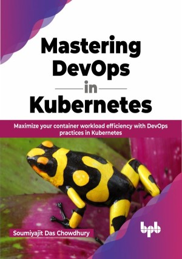

# Mastering DevOps in Kubernetes

Learn how to build, deploy, use, and maintain your applications on Kubernetes

This is the repository for [Mastering DevOps in Kubernetes
](https://bpbonline.com/products/mastering-devops-in-kubernetes?variant=42867356729544),published by BPB Publications.

## About the Book
DevOps with Kubernetes combines two powerful technologies to bring efficiency and speed to the software development process. Kubernetes has become the de facto standard for container orchestration, while DevOps practices are rapidly becoming essential for organizations to manage their software development and delivery pipelines. By using Kubernetes and DevOps practices together, teams can streamline their deployment processes, reduce errors, and deliver software faster and more reliably.

The book starts by addressing the real-time challenges and issues that DevOps practitioners face. The book then helps you become acquainted with the fundamental and advanced Kubernetes features, and develop a comprehensive understanding of the standard CNCF components that accompany Kubernetes. The book then delves deeper into the three leading managed Kubernetes services - GKE, AKS, and EKS. Additionally, the book will help to learn how to implement security measures to protect your Kubernetes deployments. The book further explores a range of monitoring tools and techniques that can be used to quickly identify and resolve issues in Kubernetes clusters. Finally, the book will help you learn how to use the Istio Service Mesh to secure communication between workloads hosted by Kubernetes.

With this information, you will be able to deploy, scale, and monitor apps on Kubernetes.

## What You Will Learn
•  Learn how to manage stateful containers with Kubernetes.

•  Get to know more observability and monitoring in Kubernetes.

•  Package and deploy applications on Kubernetes using Helm.

•  Learn how to use Skaffold and Flux for CI/CD.

•  Learn how microservices can be managed and deployed using the Istio service mesh.
